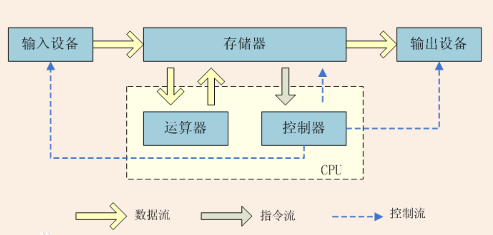

# CPU密集型和I/O密集型

先回顾下计算机的大致组成结构：

`CPU`：运算器 + 控制器

`存储器`：内存 + 外部存储

CPU, 存储器, 输入(I)、输出(O)设备等接口设备均通过`系统总线`连接在一起，也就是我们所说的主板。在总线里面有两个重要的芯片：

`北桥芯片`：离CPU最近，一般都贴有散热片，也称为主桥芯片(Host Bridge)，芯片组的命名就是以北桥芯片的名称来命名的。主要负责总线上的高速设备比如 AGP、PCI-E、内存等与CPU的数据交换，速度非常快。

`南桥芯片`：相对北桥芯片，离CPU较远，一般不会贴散热片。主要负责中低速外部设备比如 USB、PCI、IDE、SATA、网卡等，芯片中集成了中断控制器、DMA控制器等。

## CPU Bound（计算密集型）

`现象`：程序运行的时候，CPU占用率较高，I/O设备占用率较低。

`分析`：可能任务本身不太需要访问I/O设备（硬盘/内存），也可能是因为程序是多线程实现因此屏蔽掉了等待I/O的时间。大部分的状况是 CPU Loading 100%，CPU 要读/写 I/O (硬盘/内存)，I/O在很短的时间就可以完成，而 CPU 还有许多运算要处理，所以 CPU Loading 很高。`（I/O 效能 > CPU 效能）`

`优化方向`：计算量较大的程序，可以通过消息队列或其他降维算法，将计算分散到不同的计算节点。

## I/O Bound（读写密集型）

`现象`：程序运行的时候，磁盘/内存读写频繁，占用率高，CPU在等I/O的读写，到达I/O性能极限时候CPU占用率依旧很低。

`分析`：可能任务本身需要大量的I/O操作，执行任务的Pipeline（工作流水线）设计的不好，没有利用到处理器的能力。例如：在服务器上进行文件传输、磁盘读写、数据库读写等均为I/O操作。`（CPU 效能 > I/O 效能）`

`优化方向`：硬件层面对磁盘/内存进行升级，引入负载均衡，读写分离等技术。