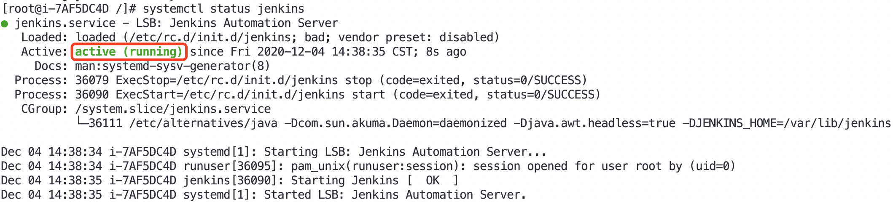
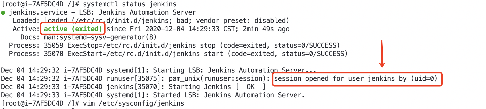
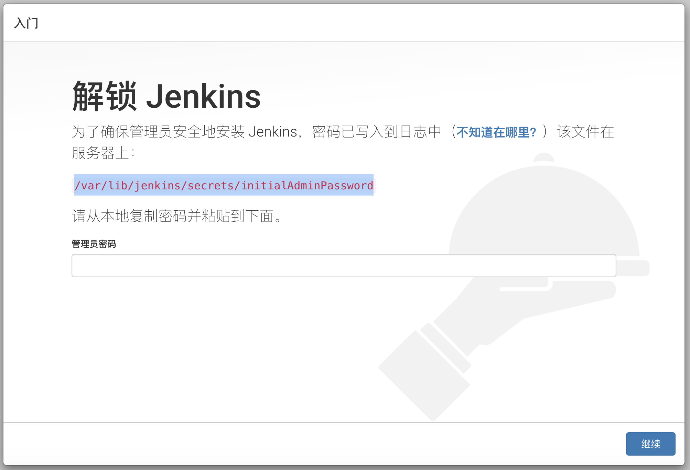
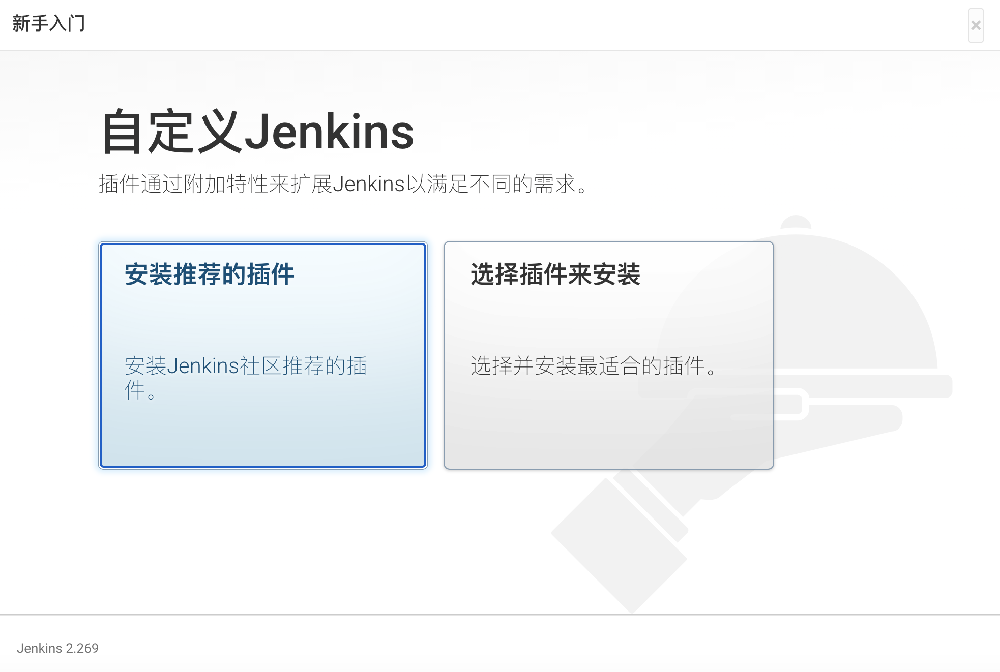
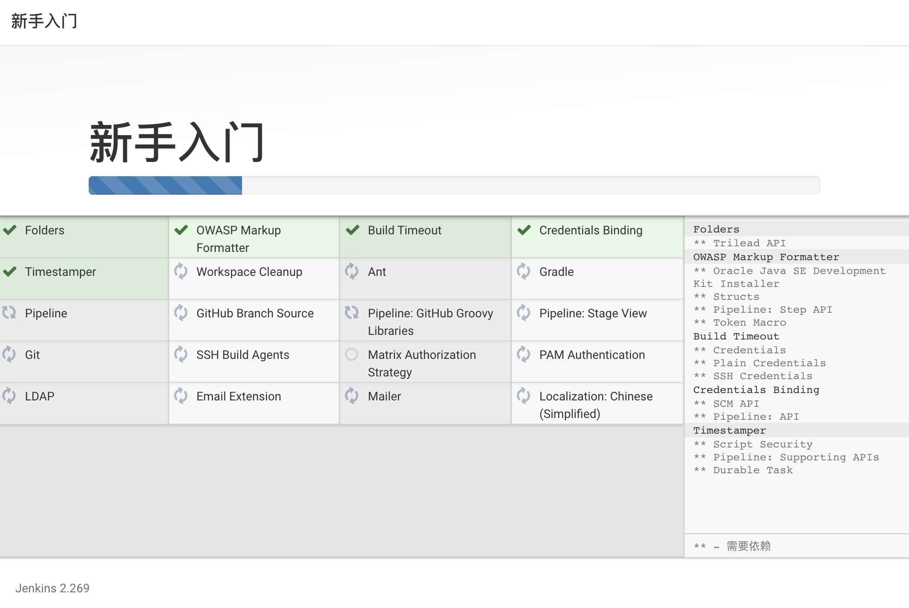
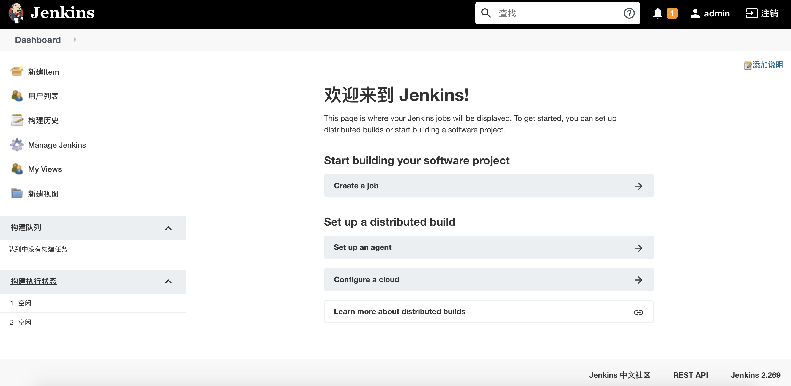

# Jenkins部署(CentOS)

Jenkins 是`CI`过程的神兵利器，本文从零开始在`CentOS 7`下部署一套Jenkins。

## 准备

依赖于 java, node, git 等基础环境，确保在安装Jenkins之前安装完成。

```bash
# 安装java
yum install -y java

# 安装node
curl --silent --location https://rpm.nodesource.com/setup_10.x | sudo bash -
yum install -y nodejs

# 安装git
yum install -y git

```

## 安装

执行以下命令：

```bash
# 添加源
wget -O /etc/yum.repos.d/jenkins.repo https://pkg.jenkins.io/redhat-stable/jenkins.repo
rpm --import https://pkg.jenkins.io/redhat-stable/jenkins.io.key

# 安装
yum install -y jenkins 
```
在执行安装的过程中，可能会遇到这样的错误：

> Public key for jenkins-2.249.1-1.1.noarch.rpm is not installed

将安装命令修改成如下可以绕过不检查 Public Key。

```bash
yum install -y jenkins --nogpgcheck
```

## 配置

Jenkins的配置文件路径：`/etc/sysconfig/jenkins`，在这里可以修改端口、用户信息、https等信息。

修改端口：`JENKINS_PORT="8080"`(如端口不冲突可以不用修改)

## 运行

```bash
# 启动
service jenkins start

# 停止
service jenkins stop

# 重启
service jenkins restart
```

在执行完`service jenkins start`命令行，我们可以通过 `systemctl status jenkins` 来查看运行状态。

`正常状态`



`异常状态`



> pam_unix(runuser:session): session opened for user jenkins by (uid=0)

错误大概意思是，会话是为 `jenkins` 用户创建的，而当前是`root`用户。解决这个问题，需要在配置文件`（/etc/sysconfig/jenkins）`中添加或者修改：

```bash
# 原来:
JENKINS_USER="jenkins"

# 修改为:
JENKINS_USER="root"
```
重启便可以回到正常状态。

说明：

* 安装成功后Jenkins将作为一个守护进程随系统自动启动
* Jenkins的RPM仓库配置地址：`/etc/yum.repos.d/jenkins.repo`
* 启动的时候从`/etc/sysconfig/jenkins`获取配置参数
* 初始密码藏在`/var/lib/jenkins/secrets/initialAdminPassword`
* 相关文件夹
    * /var/log/jenkins
    * /var/lib/jenkins
    * /var/cache/jenkins


## 访问

在浏览器中输入: `http://ip:8080` 即可进入Jenkins的初始化界面，初次访问较慢。



初次使用，需要使用默认的密码，路径如下：

```bash
cat /var/lib/jenkins/secrets/initialAdminPassword
```

输入正确的密码后，进行插件安装界面，这个过程很漫长，需要耐心等待。






最后，我们会看到这样的界面



## 修改密码

默认生成的密码是一串GUID，神仙也无法记住，因此我们需要修改密码。

* 进入 `/var/lib/jenkins/config.xml`，删除掉如下代码并保存。

```xml
<useSecurity>true</useSecurity>  
<authorizationStrategy class="hudson.security.FullControlOnceLoggedInAuthorizationStrategy">  
  <denyAnonymousReadAccess>true</denyAnonymousReadAccess>  
</authorizationStrategy>  
<securityRealm class="hudson.security.HudsonPrivateSecurityRealm">  
  <disableSignup>true</disableSignup>  
  <enableCaptcha>false</enableCaptcha>  
</securityRealm>  
```

* 重启服务 `service jenkins restart`
* 进入首页 > 系统管理 > 全局安全配置 (Configure Global Security)，勾选`启动安全`
* 勾选`Jenkins 专有用户数据库`
* 重新点击首页 >  系统管理，发现此时出现`管理用户`
* 进入展示用户列表，并修改密码，修改后重新登录

## 插件安装失败

Jenkins在安装插件的时候经常遇到失败的情况，其失败的原因是多种多种多样的。 