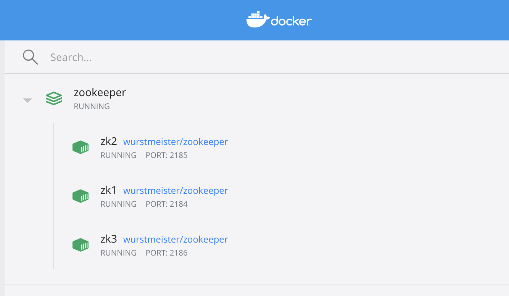
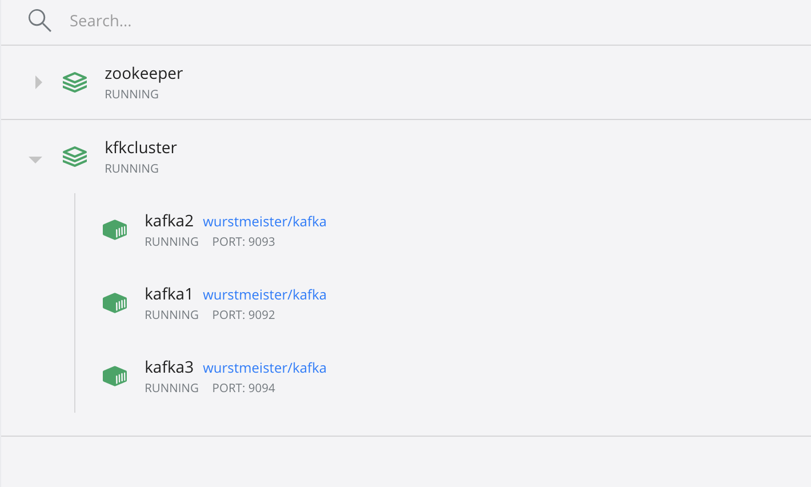
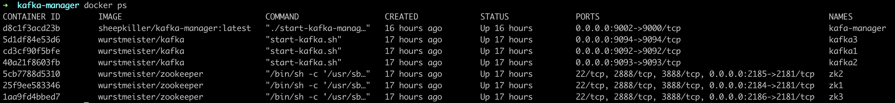

# Kafka集群部署

## 镜像选择

1. zookeeper（image: wurstmeister/zookeeper）
2. kafka（image: wurstmeister/kafka）
3. kafka-manager（image: sheepkiller/kafka-manager）

## 集群规划

目标是在一台宿主机器(Mac OSX)中创建3个`zookeeper`和3个`kafka`，使kafka集群在docker网络中和zookeeper处于同一网络。

宿主机器: `IP: 192.168.1.104` (需要根据实际情况进行设置)

Host | Ip |  Port | Listener
-|-|-|-
zk1 | 172.19.0.11 | 2184:2181 | |
zk2 | 172.19.0.12 | 2185:2181 | |
zk3 | 172.19.0.13 | 2186:2181 | |
kafka1 | 172.19.0.14 | 9092:9092 | kafka1 |
kafka2 | 172.19.0.15 | 9093:9093 | kafka2 |
kafka3 | 172.19.0.16 | 9094:9094 | kafka3 |

## 部署zk集群

1. 创建zookeeper物理存储：其中物理存储卷的位置是：`/Users/yulsh/Documents/docker-workspace/zookeeper` （根据实际情况调整）。
2. 创建docker桥接网络 `br17219`。
```
docker network create --driver bridge --subnet 172.19.0.0/24 --gateway 172.19.0.1 br17219
```
通过docker network，只有使用–subnet创建的网络才能指定静态IP，在下文的 docker-compose.yml 中指定了静态ip。其中`–subnet`用来指定ip段，`–gateway` 用来指定网关，`br17219`为创建的名字。

3. 编写docker-compose.yml

```yml
version: '3.4'

services:
  zk1:
    image: wurstmeister/zookeeper
    restart: always
    hostname: zk1
    container_name: zk1
    ports:
    - 2184:2181
    volumes:
    - "/Users/yulsh/Documents/docker-workspace/zookeeper/zk1/data:/data"
    - "/Users/yulsh/Documents/docker-workspace/zookeeper/zk1/datalog:/datalog"
    environment:
      ZOO_MY_ID: 1
      ZOO_SERVERS: server.1=0.0.0.0:2888:3888 server.2=zk2:2888:3888 server.3=zk3:2888:3888
    networks:
      br17219:
        ipv4_address: 172.19.0.11

  zk2:
    image: wurstmeister/zookeeper
    restart: always
    hostname: zk2
    container_name: zk2
    ports:
    - 2185:2181
    volumes:
    - "/Users/yulsh/Documents/docker-workspace/zookeeper/zk2/data:/data"
    - "/Users/yulsh/Documents/docker-workspace/zookeeper/zk2/datalog:/datalog"
    environment:
      ZOO_MY_ID: 2
      ZOO_SERVERS: server.1=zk1:2888:3888 server.2=0.0.0.0:2888:3888 server.3=zk3:2888:3888
    networks:
      br17219:
        ipv4_address: 172.19.0.12

  zk3:
    image: wurstmeister/zookeeper
    restart: always
    hostname: zk3
    container_name: zk3
    ports:
    - 2186:2181
    volumes:
    - "/Users/yulsh/Documents/docker-workspace/zookeeper/zk3/data:/data"
    - "/Users/yulsh/Documents/docker-workspace/zookeeper/zk3/datalog:/datalog"
    environment:
      ZOO_MY_ID: 3
      ZOO_SERVERS: server.1=zk1:2888:3888 server.2=zk2:2888:3888 server.3=0.0.0.0:2888:3888
    networks:
      br17219:
        ipv4_address: 172.19.0.13

networks:
  br17219:
    external:
      name: br17219
```

4. 运行`docker-compose up -d` 启动zookeeper

通过 Dashboard 查看zk1，zk2，zk3的状态：



## 部署kafka集群

1. 创建kafka物理存储：其中物理存储卷的位置是：`/Users/yulsh/Documents/docker-workspace/kfkcluster` （根据实际情况调整）
。
2. 编写docker-compose.yml

```yml
version: '2.2'

services:
  kafka1:
    image: wurstmeister/kafka
    restart: always
    hostname: kafka1
    container_name: kafka1
    ports:
    - 9092:9092
    environment:
      KAFKA_ADVERTISED_HOST_NAME: kafka1
      KAFKA_ADVERTISED_PORT: 9092
      KAFKA_ZOOKEEPER_CONNECT: zk1:2181,zk2:2181,zk3:2181
    volumes:
    - /Users/yulsh/Documents/docker-workspace/kfkcluster/kafka1/logs:/kafka
    external_links:
    - zk1
    - zk2
    - zk3
    networks:
      br17219:
        ipv4_address: 172.19.0.14

  kafka2:
    image: wurstmeister/kafka
    restart: always
    hostname: kafka2
    container_name: kafka2
    ports:
    - 9093:9093
    environment:
      KAFKA_ADVERTISED_HOST_NAME: kafka2
      KAFKA_ADVERTISED_PORT: 9093
      KAFKA_ZOOKEEPER_CONNECT: zk1:2181,zk2:2181,zk3:2181
    volumes:
    - /Users/yulsh/Documents/docker-workspace/kfkcluster/kafka2/logs:/kafka
    external_links:
    - zk1
    - zk2
    - zk3
    networks:
      br17219:
        ipv4_address: 172.19.0.15

  kafka3:
    image: wurstmeister/kafka
    restart: always
    hostname: kafka3
    container_name: kafka3
    ports:
    - 9094:9094
    environment:
      KAFKA_ADVERTISED_HOST_NAME: kafka3
      KAFKA_ADVERTISED_PORT: 9094
      KAFKA_ZOOKEEPER_CONNECT: zk1:2181,zk2:2181,zk3:2181
    volumes:
    - /Users/yulsh/Documents/docker-workspace/kfkcluster/kafka3/logs:/kafka
    external_links:
    - zk1
    - zk2
    - zk3
    networks:
      br17219:
        ipv4_address: 172.19.0.16

networks:
  br17219:
    external:
      name: br17219
```

3. 运行`docker-compose up -d` 启动kafka

通过 Dashboard 查看kafka1，kafka2，kafka3的状态：



## 部署kafka-manager
kafka-manager的作用是管理kafka集群，基于docker-compose来部署。

1. 编写docker-compose.yml

```
version: '2'

services:
  kafka-manager:
    image: sheepkiller/kafka-manager:latest
    restart: always
    container_name: kafa-manager
    hostname: kafka-manager
    ports:
      - "9002:9000"
    environment:
      ZK_HOSTS: zk1:2181,zk2:2181,zk3:2181
      KAFKA_BROKERS: kafka1:9092,kafka2:9093,kafka3:9094
      APPLICATION_SECRET: letmein
      KM_ARGS: -Djava.net.preferIPv4Stack=true
    networks:
      default:
        ipv4_address: 172.19.0.10

networks:
  default:
    external:
      name: br17219
```

2. 访问`http://127.0.0.1:9000` 查看

## 查看运行

`docker ps` 查看容器的状态，至此，所有的服务均已正常运行。



