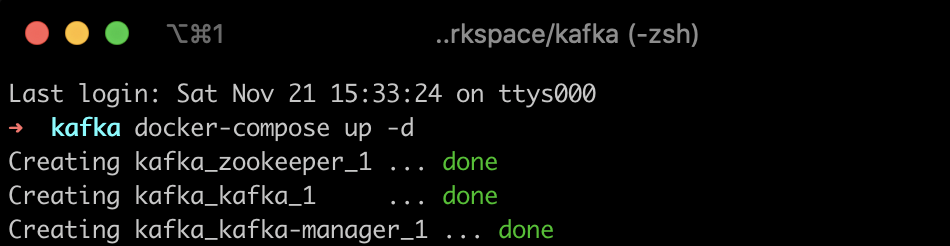
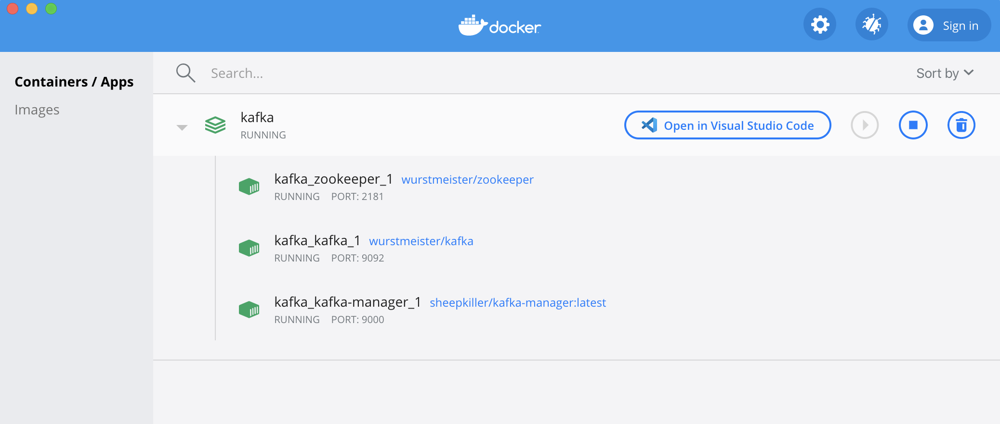
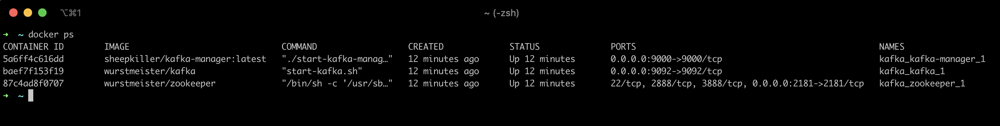
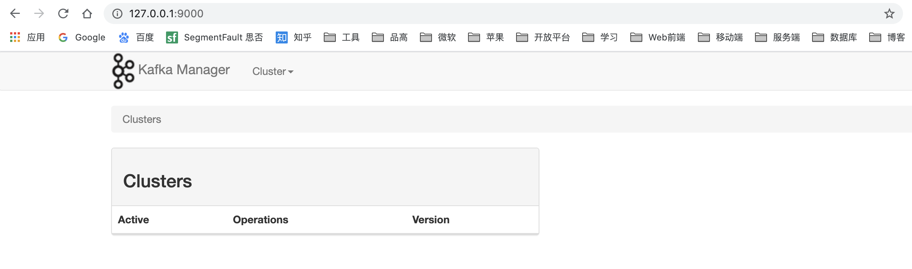

# Kafka安装&运行

自从学习了Docker的相关知识，凡是能够基于docker来部署的，坚决不用传统的部署方式。这里基于 docker-compose 来实现快速部署。Kafka的部署涉及3个方面的镜像:
1. zookeeper（image: wurstmeister/zookeeper）
2. kafka（image: wurstmeister/kafka）
3. kafka-manager（image: sheepkiller/kafka-manager:latest）

其中`kafka-manager`是用是个可视化的管理工具，下文也有介绍其他的工具来配合使用。接下来，编写一份`docker-compose.yml`来实现在本地快速部署 Kafka 相关服务。

## docker-compose.yml

相比json文件，yml的编写更加灵活，层次结构更加鲜明，唯一缺点是容易出错。下面这一份yml可以在本地将以上3个服务快速部署起来。

```yml
# Docker compose to have Zookeeper, Kafka, and Kafka Manager running for development.

zookeeper:
  image: wurstmeister/zookeeper
  ports:
    - "2181:2181"
 
kafka:
  image: wurstmeister/kafka
  ports:
    - "9092:9092"
  links:
    - zookeeper:zk
  environment:
    - KAFKA_ADVERTISED_HOST_NAME
    - KAFKA_ADVERTISED_PORT=9092
    - KAFKA_DELETE_TOPIC_ENABLE=true
    - KAFKA_LOG_RETENTION_HOURS=1
    - KAFKA_MESSAGE_MAX_BYTES=10000000
    - KAFKA_REPLICA_FETCH_MAX_BYTES=10000000
    - KAFKA_GROUP_MAX_SESSION_TIMEOUT_MS=60000
    - KAFKA_NUM_PARTITIONS=2
    - KAFKA_DELETE_RETENTION_MS=1000
    - KAFKA_ZOOKEEPER_CONNECT=192.168.1.104:2181 # 连接zookeeper 的ip和端口，必须使用机器的ip
    - KAFKA_ADVERTISED_LISTENERS=PLAINTEXT://192.168.1.104:9092 # 设置监听，必须使用机器的ip
    - KAFKA_LISTENERS=PLAINTEXT://0.0.0.0:9092
 
kafka-manager:
  image: sheepkiller/kafka-manager:latest
  ports:
    - "9000:9000"
  links:
    - zookeeper
    - kafka
  environment:
    ZK_HOSTS: zookeeper:2181
    APPLICATION_SECRET: letmein
    KM_ARGS: -Djava.net.preferIPv4Stack=true

```

## 运行服务

执行如下命令：
```
docker-compose up -d
```



在`Docker Dashboard`中查看服务运行的情况：

也可以通过命令行查看服务运行状态:



## 可视化管理
借助`kafka-manager`可以进行kafka集群管理，假如已经成功部署好了上面的服务，在浏览器中输入`http://127.0.0.1:9000/`


在这里可以管理`kafka集群`，查看`Topic`，`Broker`等。