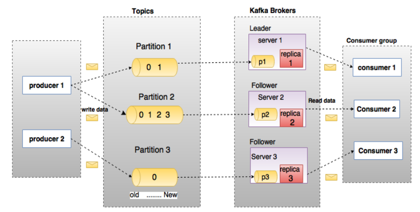

# Kafka简介

Kafka是最初由`Linkedin`公司开发，是一个分布式、分区的、多副本的、多订阅者、基于`zookeeper`协调的分布式日志系统（也可以当做MQ系统），常见可以用于web/nginx日志、访问日志，消息服务等等，于2010年贡献给了Apache基金会并成为顶级开源项目。

主要应用场景是：`日志收集系统`和`消息系统`。

1. 以时间复杂度为O(1)的方式提供消息持久化能力，即使对TB级以上数据也能保证常数时间的访问性能。
2. 高吞吐率。即使在非常廉价的商用机器上也能做到单机支持每秒100K条消息的传输。
3. 支持Kafka Server间的消息分区，及分布式消费，同时保证每个partition(分区)内的消息顺序传输。
4. 同时支持离线数据处理和实时数据处理。
5. 支持在线水平扩展。

# 关于消息系统

一个消息系统负责将数据从一个应用传递到另外一个应用，应用只需关注于数据，无需关注数据在两个或多个应用间是如何传递的。分布式消息传递基于可靠的消息队列，在客户端应用和消息系统之间异步传递消息。有两种主要的消息传递模式：`点对点传递模式、发布-订阅模式`。大部分的消息系统选用发布-订阅模式。`Kafka就是一种发布-订阅模式(Pub/Sub)`。

## 点对点消息系统
在点对点消息系统中，消息持久化到一个队列中。此时，将有一个或多个消费者消费队列中的数据。但是一条消息只能被消费一次。当一个消费者消费了队列中的某条数据之后，该条数据则从消息队列中删除。该模式即使有多个消费者同时消费数据，也能保证数据处理的顺序。这种架构描述示意图如下：

注意：`生产者发送一条消息到queue，只有一个消费者能收到。`

## 发布-订阅消息系统
在发布-订阅消息系统中，消息被持久化到一个topic中。与点对点消息系统不同的是，消费者可以订阅一个或多个topic，消费者可以消费该topic中所有的数据，同一条数据可以被多个消费者消费，数据被消费后不会立马删除。在发布-订阅消息系统中，消息的生产者称为发布者，消费者称为订阅者。该模式的示例图如下：

注意: `发布者发送到topic的消息，只有订阅了topic的订阅者才会收到消息。`

# 相关术语

下面一幅图展示了kafka相关术语之间的关系：

上图中一个topic配置了3个partition。Partition1有两个offset：0和1。Partition2有4个offset。Partition3有1个offset。(offset偏移量， 无论是 producer 往 topic 中写数据, 还是 consumer 从 topic 中读数据, 都避免不了和 offset 打交道)。如果一个topic的副本数为3，那么Kafka将在集群中为每个partition创建3个相同的副本。集群中的每个broker存储一个或多个partition。多个producer和consumer可同时生产和消费数据。

## broker（节点）
Kafka 集群包含一个或多个服务器，服务器节点称为broker，broker存储topic的数据。存储方式有多种：
1. 如果某topic有N个partition，集群有N个broker，那么每个broker存储该topic的一个partition。
2. 如果某topic有N个partition，集群有(N+M)个broker，那么其中有N个broker存储该topic的一个partition，剩下的M个broker不存储该topic的partition数据。
3. 如果某topic有N个partition，集群中broker数目少于N个，那么一个broker存储该topic的一个或多个partition。在实际生产环境中，尽量避免这种情况的发生，这种情况容易导致Kafka集群数据不均衡。

## topic（主题）
每条发布到Kafka集群的消息都有一个类别，这个类别被称为Topic，物理上不同Topic的消息分开存储，逻辑上一个Topic的消息虽然保存于一个或多个broker上，但用户只需指定消息的Topic即可生产或消费数据而不必关心数据存于何处。类似于数据库的表名。

## partition（分区）
topic中的数据分割为一个或多个partition。每个topic至少有一个partition。每个partition中的数据使用多个segment文件存储。partition中的数据是有序的，不同partition间的数据丢失了数据的顺序。如果topic有多个partition，消费数据时就不能保证数据的顺序。在需要严格保证消息的消费顺序的场景下，需要将partition数目设为1。

## producer（生产者）
生产者即数据的发布者，该角色将消息发布到Kafka的topic中。broker接收到生产者发送的消息后，broker将该消息追加到当前用于追加数据的segment文件中。生产者发送的消息，存储到一个partition中，生产者也可以指定数据存储的partition。

## consumer（消费者）
消费者可以从broker中读取数据。消费者可以消费多个topic中的数据。

## consumer group（消费者组）
每个Consumer属于一个特定的Consumer Group（可为每个Consumer指定group name，若不指定group name则属于默认的group）。

## leader（主分区）
每个partition有多个副本，其中有且仅有一个作为Leader，Leader是当前负责数据的读写的partition。

## follower（从分区）
Follower跟随Leader，所有写请求都通过Leader路由，数据变更会广播给所有Follower，Follower与Leader保持数据同步。如果Leader失效，则从Follower中选举出一个新的Leader。当Follower与Leader挂掉、卡住或者同步太慢，leader会把这个follower从“in sync replicas”（ISR）列表中删除，重新创建一个Follower。

